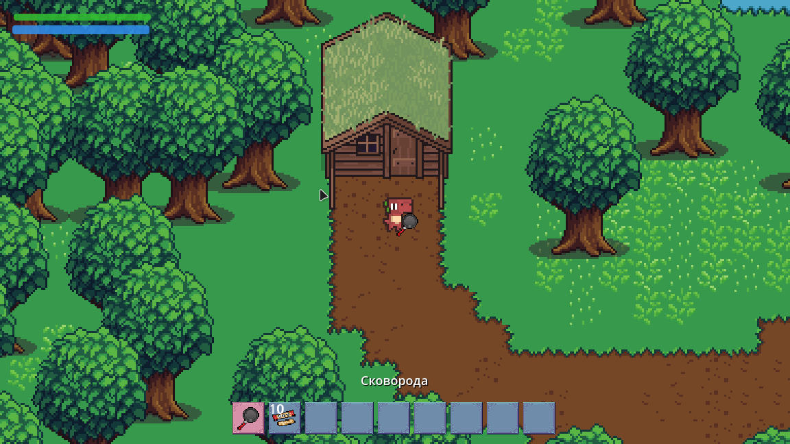
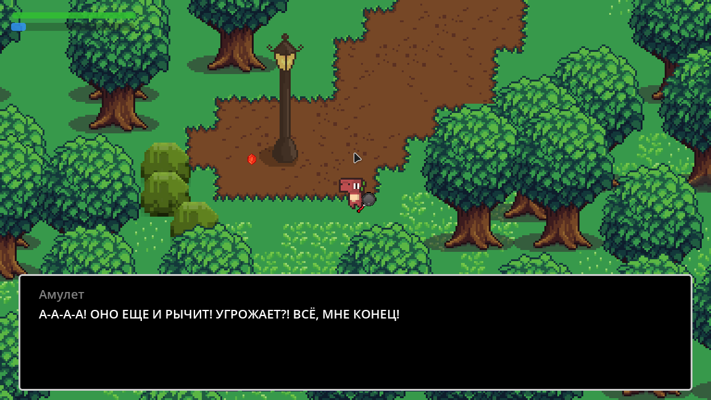
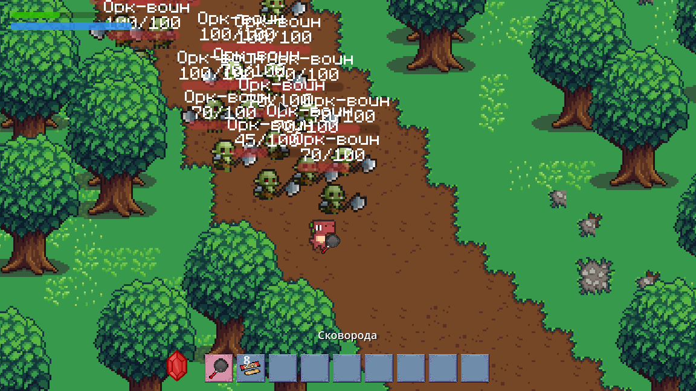

# 🎉 Darisenok 🎉

Это 2D-игра, разработанная на движке Godot в качестве необычного поздравления с днем рождения для сестры

**Русский** | [English](README.md)

## 📋 Об игре

"Darisenok" - приключенческая игра TopDown, в которой игрок исследует мир, взаимодействует с персонажами, сражается с врагами. Основная цель игры - поздравление

## 🖼️ Скриншоты





## 🚀 Технологии

*   **Игровой движок**: [Godot Engine](https://godotengine.org/)
*   **Язык программирования**: GDScript
*   **Диалоги**: [Dialogue Manager](https://github.com/nathanhoad/godot_dialogue_manager)

## 📦  Начало работы

1.  **Клонируйте репозиторий:**
    ```sh
    git clone https://github.com/your_username/Darysenok.git
    ```
2.  **Откройте проект в Godot:**
3.  **Запустите игру:**